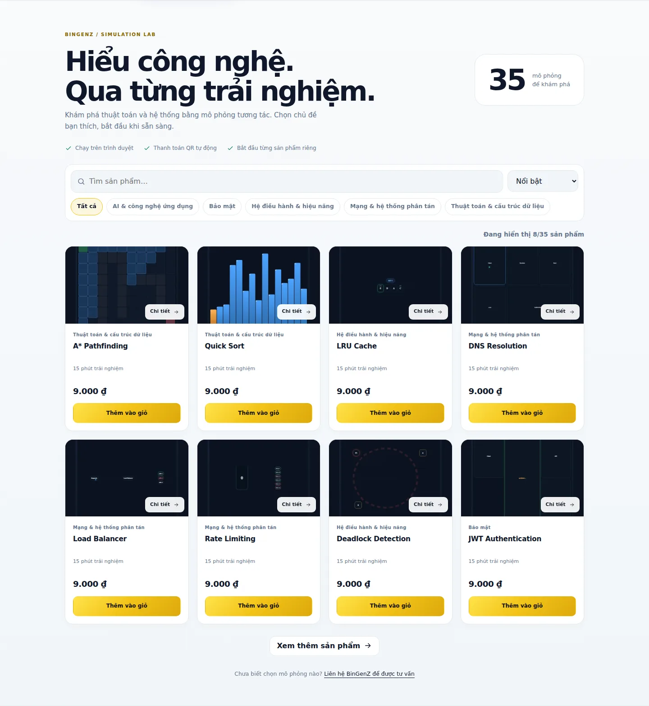
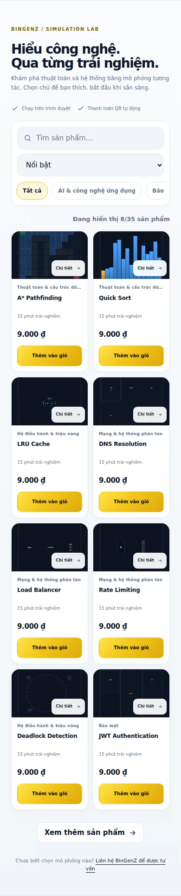
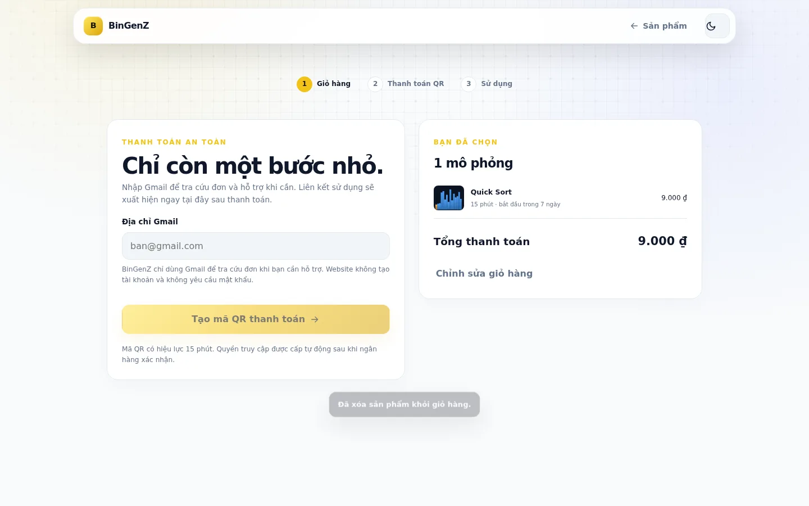
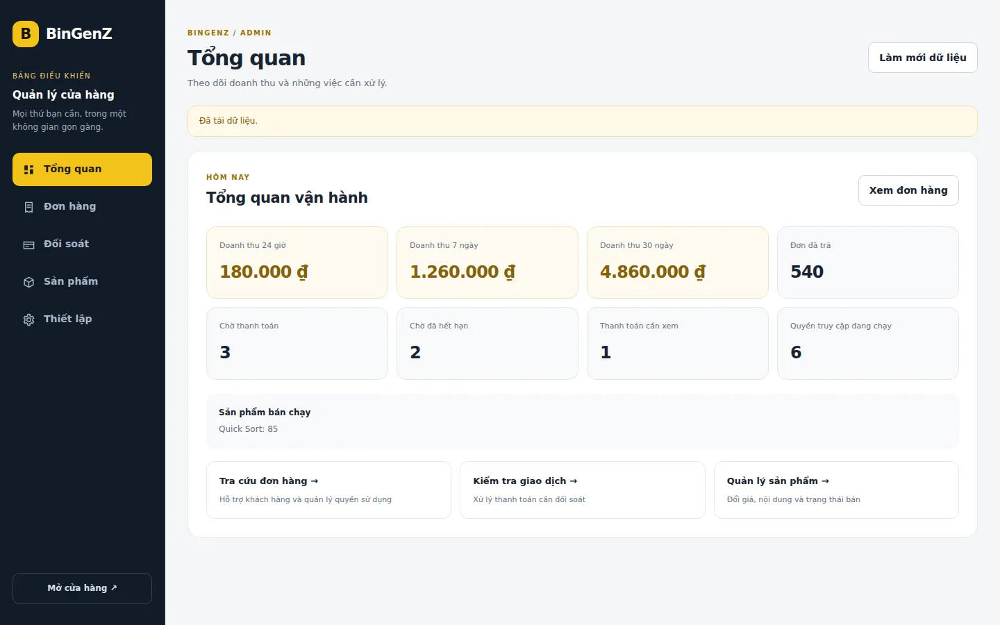
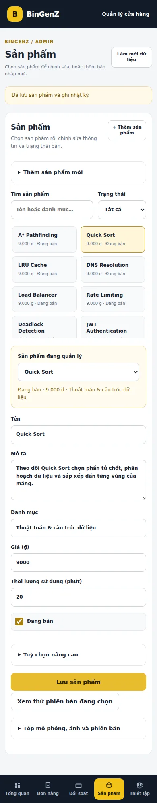

# Giao diện cửa hàng và quản trị mới — 01/10/2026

Bản thiết kế đã triển khai trên nhánh `codex/storefront-admin-redesign`, dựa trên commit `83c4684` của `master`. Chưa triển khai lên production.

## Định hướng

Giữ nhận diện BinGenZ với màu vàng, hỗ trợ sáng/tối ở cửa hàng, ưu tiên thao tác trên điện thoại. Admin chuyển sang không gian làm việc nền sáng với từng màn hình riêng để tránh phải cuộn qua toàn bộ biểu mẫu.

| Khu vực | Thay đổi |
| --- | --- |
| Sản phẩm | Thẻ có danh mục, thời lượng, giá và nút xem chi tiết; 2 cột trên điện thoại; tìm kiếm, lọc danh mục, sắp xếp và tải thêm |
| Chi tiết | Ảnh, mô tả, thời lượng, hạn bắt đầu, lưu ý thời gian tính liên tục và thêm vào giỏ |
| Giỏ hàng | Tổng tiền và số mô phỏng rõ ràng; xoá từng sản phẩm hoặc cả giỏ |
| Nhập Gmail | Hiển thị sản phẩm, thời lượng, hạn bắt đầu, tổng tiền và sửa giỏ ngay tại bước này |
| QR | Tiến trình 3 bước; desktop 2 cột, điện thoại xếp dọc; thời hạn 15 phút, tải QR và sao chép thông tin chuyển khoản |
| Quyền sử dụng | Tiến trình hoàn tất, lưu liên kết và bắt đầu riêng từng mô phỏng |
| Admin | Tổng quan / Đơn hàng / Đối soát / Sản phẩm / Thiết lập; sidebar desktop và thanh điều hướng dưới trên mobile |
| Quản lý sản phẩm | Tìm theo tên/danh mục, lọc đang bán/bản nháp/lưu trữ, danh sách chọn nhanh, nhập thời lượng bằng phút, tự gợi ý slug khi tạo mới |
| Tác vụ nâng cao | Thu gọn slug, thứ tự, hạn kích hoạt, lưu trữ, tệp HTML, phiên bản và hoàn tiền; vẫn dùng API có kiểm tra quyền và ghi audit |

## Cách dùng admin

1. Vào **Sản phẩm**, tìm và chọn mô phỏng, sửa thông tin rồi bấm **Lưu sản phẩm**. Nếu chuyển sản phẩm khi chưa lưu, giao diện yêu cầu xác nhận.
2. Bấm **Thêm sản phẩm** để tạo bản nháp. Mở **Tệp mô phỏng, ảnh và phiên bản** để tải gói HTML riêng tư và ảnh WebP. Kiểm tra phiên bản trước khi bật bán.
3. Vào **Đơn hàng**, tìm Gmail hoặc mã BGZ, mở chi tiết để ghi chú hoặc hỗ trợ quyền. Cấp lại liên kết và hoàn tiền nằm trong mục thu gọn, với xác minh và xác nhận như trước.
4. Vào **Đối soát**, chọn giao dịch rồi mở biểu mẫu kiểm tra. Tiền thiếu/thừa/sai mã/đến muộn vẫn cần xử lý có xác nhận.
5. Vào **Thiết lập** để đổi hạn bắt đầu mặc định, xuất CSV hoặc chỉnh sửa hàng loạt.

Ngày giờ được định dạng theo giờ Việt Nam ở danh sách đơn, tóm tắt đơn và danh sách phiên bản. Bộ lọc trạng thái đơn áp dụng cho danh sách tối đa 100 kết quả do API hiện tại trả về; không phải bộ lọc toàn bộ lịch sử.

## Kiểm tra

- `npm test`: **43/43 qua**, gồm kiểm thử Worker/D1/R2 thật trong môi trường local và trình duyệt.
- Bộ mới kiểm tra desktop 1440px, mobile 390px/360px; sáng/tối; 2 cột; không tràn ngang; chi tiết sản phẩm; tổng tiền sau sửa giỏ; bộ lọc admin; quy đổi phút sang giây; bảo vệ thay đổi chưa lưu.
- Bộ tích hợp tiếp tục kiểm tra QR/countdown/polling sang trang quyền, xác thực admin, tạo bản nháp/tải HTML/ảnh/mở bán/lưu trữ, hỗ trợ quyền, ghi chú và hoàn tiền có audit.
- Asset dùng cùng token `20261001-1`, kể cả admin. Đã kiểm tra cùng browser context mở URL asset cũ rồi tải lại shell mới.
- `wrangler deploy --dry-run --config wrangler.toml`: qua. Không thay đổi backend, schema, binding, secret hay cấu hình triển khai.
- Chưa kiểm tra thanh toán thật, Turnstile thật hoặc Cloudflare Access live trong bản này. Các ảnh dưới dùng dữ liệu kiểm thử; nút tạo QR chưa được mở khoá bởi Turnstile thật.

## Ảnh xem trước

Catalogue được chụp riêng; thanh điều hướng cố định của trang chủ được ẩn khi chụp để tránh che phần nội dung.

### Cửa hàng desktop

### Cửa hàng điện thoại

### Thanh toán desktop

### Tổng quan admin

### Quản lý sản phẩm trên điện thoại

## Phát hành

Duyệt nhánh/PR trước khi merge vào `master`, vì `master` là nhánh triển khai production. Sau khi triển khai, xác nhận token HTML/asset mới trên `bingenz.com`, kiểm tra sáng/tối trong trình duyệt đã dùng bản cũ và kiểm tra admin qua Access thật. Kiểm thử quy trình QR bằng môi trường preview riêng trước khi dùng giao dịch thật. Không chạy migration cho thay đổi này.

Nếu cần quay lại, revert commit giao diện rồi phát hành với một token asset mới để trình duyệt cập nhật. Không rollback D1/R2.
