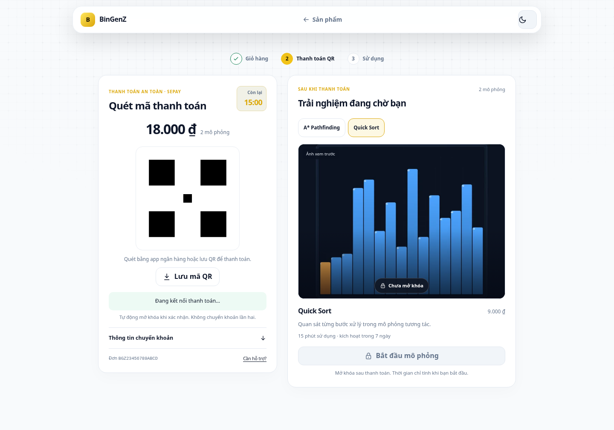
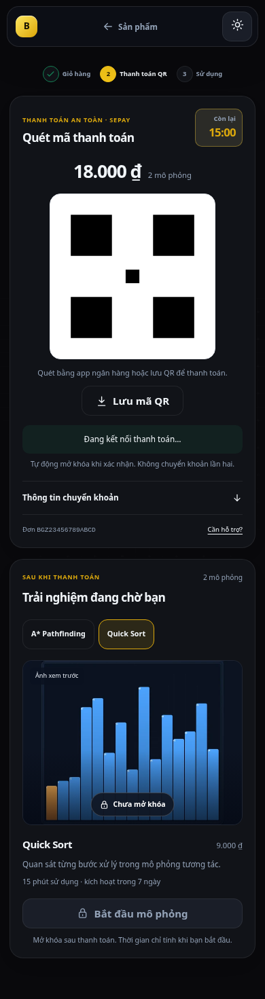

# Thanh toán QR và xem trước sản phẩm

Màn hình tập trung vào tổng tiền, QR, thời hạn và trạng thái xác nhận. Thông tin chuyển khoản thủ công nằm trong mục thu gọn; tự mở khi QR tải lỗi.

Preview dùng thumbnail công khai của đúng sản phẩm, tên, mô tả và thời lượng. Khách có thể chọn ảnh của từng mô phỏng trong đơn. Nút bắt đầu bị khóa; không tải iframe hoặc mã mô phỏng trả phí khi đang chờ thanh toán. Sau xác nhận, luồng cấp quyền hiện có đưa khách tới trang sử dụng. Đồng hồ sử dụng chỉ bắt đầu khi khách xác nhận bắt đầu mô phỏng.

API đơn hàng bổ sung thumbnail, mô tả công khai và thời hạn kích hoạt; giá, tên, thời lượng và thời hạn kích hoạt lấy từ bản ghi sản phẩm trong đơn. Không thay đổi schema, webhook hoặc cơ chế kiểm tra quyền truy cập. Thumbnail và mô tả phản ánh thông tin công khai hiện tại của sản phẩm.

Ảnh dưới đây được chụp từ fixture kiểm thử: **QR minh họa, không dùng để thanh toán**.

Chạy `npm test` để kiểm tra giao diện, QR lỗi, mất kết nối, hết hạn và thanh toán thành công qua Worker. Kiểm thử responsive gồm 320, 360, 390, 768 và 1440 px, cả giao diện sáng/tối; đơn 35 sản phẩm không tràn ngang.
